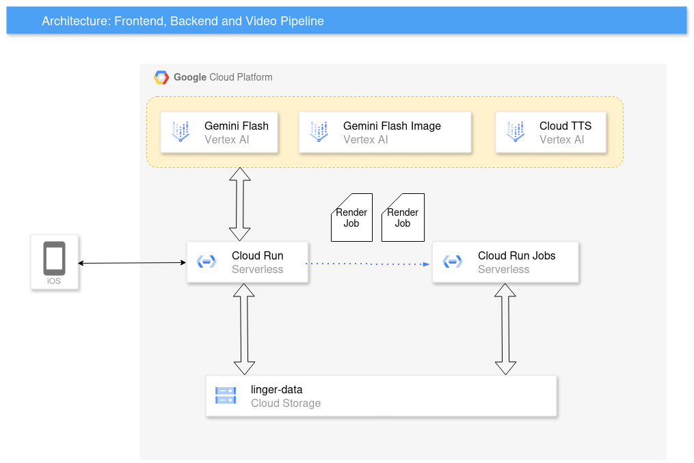
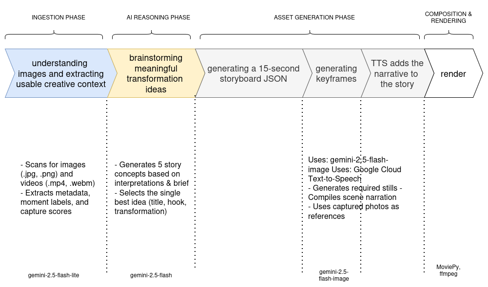

# Linger — Give Things a Second Life 🌿

<p>
 <a></a>
 <a></a>
 <a></a>
 <a></a>
 <a></a>
 <a></a>
</p>

**Linger** is a mobile-first multimodal agent that helps people reimagine household items before they become waste.
Instead of starting from an empty prompt box, Linger starts from the **camera**: it studies a real object, 
scans the surrounding room for real constraints and opportunities, and turns that evidence into a short, grounded 15–30 second story reel.

The core product thesis is simple:

> Reuse becomes more compelling when AI behaves less like a chatbot and more like a creative director.


Instead of a text-box chat, Linger acts as your real-time spatial creative director. It "sees" an object you are about to discard, 
scans your room for inspiration, and generates a compelling second-life concept in the form of a 15-30 second mixed-media video reel.

---

## Why this repo matters

Linger was built for a **beyond-text** interaction model. The experience is intentionally multimodal end to end:

- **Input:** live camera, hero image, room context, short voice/text coaching
- **Reasoning:** image interpretation, frame scoring, idea generation, storyboard planning
- **Output:** selected real captures, generated support keyframes, narration, final MP4 reel

This repository contains both sides of that experience:

1. **The Scout** — a mobile-first capture agent that collects grounded visual evidence.
2. **The Director** — a story generation pipeline that turns that evidence into a compelling mixed-media reel.

---

## What the user experiences

1. The user taps **Start the story**.
2. They capture one strong **hero photo** of the item.
3. Linger analyzes that photo and produces a practical capture plan.
4. The user enters **Harvest Mode** and scans the room in vertical video.
5. The backend samples stop-shots, scores them, deduplicates them, and keeps only the strongest story moments.
6. The app presents a compact review card.
7. The backend exports a grounded story basket and triggers video generation.
8. A shareable reel is rendered and returned through a lightweight share page.

The result is not a generic suggestion like “turn this jar into a vase.” It is a small, evidence-backed narrative with a hook, a tone, selected real frames, optional generated keyframes, voiceover, and final composition.

---

## 🧠 Dual AI Roles & High-Level Architecture

The architecture deliberately keeps the genuinely agentic parts as agentic, and keeps the rest deterministic. 
There are two conceptual intelligence layers:

### 1. The Scout (Capture Intelligence)


[Open full-size diagram](./docs/scout-pipeline.png)

A mobile-first PWA for two-stage multimodal capture. This smart app interprets the hero frame, scores later stop-shots, and gives very short guidance. 
It acts like a cinematography coach, not just an object detector.
* **Frontend:** React app, mobile-first camera UI, uses browser `getUserMedia` APIs, and sends blobs to the backend.
* **Backend:** FastAPI app that owns session state, calls Gemini models via Google GenAI SDK, and provides frame scoring.

### 2. The Director (Storyteller Intelligence)


[Open full-size diagram](./docs/arch-director.png)


An async backend pipeline that takes the chosen frames, generates story ideas and storyboard structure, 
and hands off to still generation, narration, and video composition.

---

## 🤝 System Handoff Contract

The handoff between the Live Capture app and the Story Pipeline is a clean, composable JSON object ("The Basket"). 
This ensures the downstream pipeline has stable, high-quality inputs:

```json
{
  "session_id": "linger-abc123",
  "hero_image": "/session_cache/.../hero.jpg",
  "selected_frames": [
    "/session_cache/.../frame_03.jpg",
    "/session_cache/.../frame_07.jpg"
  ],
  "stage1_analysis": {
    "object_label": "Glass jar",
    "story_signal": "A humble discarded container that can become a useful home detail."
  },
  "story_seed": {
    "hook": "This nearly became trash, then found a place in the room.",
    "visual_style": "clean motion-comic",
    "generation_strategy": "4 stills + 1 optional hero clip"
  }
}

```
## Technical deep dive

### Technologies and models used

| Model / Tool             | Action / Output                                      |
|--------------------------|------------------------------------------------------|
| `gemini-2.5-flash-lite`  | Interprets the input images.                         |
| `gemini-2.5-flash`       | Brainstorms 5 story concepts.                        |
| `gemini-2.5-flash`       | Creates a strict JSON storyboard for **30 seconds**. |
| `gemini-2.5-flash-image` | Generates only the missing keyframes.                |
| `gemini-2.5-flash-lite`  | Judges those generated images for slop / quality.    |
| Cloud TTS (`Chirp 3 HD`) | Generates narration.                                 |
| `moviepy`                | Assembles a local MP4 with subtitles.                |


### Frontend: camera-first React app

The frontend is a mobile-first React experience built around the browser camera lifecycle rather than a form-driven workflow.

Key technical details:

- Uses `getUserMedia` with viewport-aware camera constraints for vertical capture.
- Captures stills from the live stream via an off-screen canvas.
- Applies explicit request timeouts for hero capture, frame analysis, and finalize steps.
- Uses a **backpressure-aware harvest loop**: the client will not send a new frame while a previous scoring request is still in flight.
- Auto-stops once the system has enough usable evidence or reaches configured scan limits.
- Includes a built-in **Debug Drawer** for state, config, and recent event inspection.
- Falls back to browser speech synthesis if server-side guide TTS is unavailable.

Why this matters: the UI is doing more than transport. It actively protects the feel of the experience by keeping the camera live, the feedback fast, and the network load bounded.

### Backend: FastAPI live capture service

The backend owns session state, AI orchestration, storage, and finalization.

Main responsibilities:

- **Stage 1 hero analysis** via `/api/stage1/analyze-photo`
- **Harvest initialization** via `/api/live/start`
- **Per-frame scoring** via `/api/live/frame`
- **Manual stop / seed refresh** via `/api/live/harvest/stop` and `/api/story/seed`
- **Light conversational guidance** via `/api/live/chat`
- **Session inspection** via `/api/session/{session_id}`
- **Story basket finalization** via `/api/session/finalize`
- **Share / playback** via the story page and `/api/story/{session_id}/video.mp4`

Operational details:

- Session state is persisted under `session_cache/<session_id>/state.json`.
- The backend supports both **local storage** and **Google Cloud Storage** through a unified storage backend.
- Signed URLs are generated when assets are stored in GCS.
- Structured JSON logging captures request IDs, latency, and event types for easier debugging.
- A lightweight websocket channel is available for session updates.

### Live guidance and multimodal reasoning

Linger uses two different reasoning modes during capture:

- **Stage 1 object understanding**: understand the hero object, story signal, capture goals, and risks.
- **Stage 2 frame scoring**: score stop-shots by usefulness, clarity, novelty, role, and duplicate likelihood.

The live guidance agent is intentionally constrained:

- short replies,
- one concrete next instruction,
- room-need-first framing,
- no speculative final concept until evidence is strong.

This keeps the system feeling like a creative scout instead of a verbose chatbot.

### Frame ranking, deduplication, and fallback design

One of the strongest technical choices in this repo is that capture quality is treated as a first-class systems problem.

The backend does not blindly keep every frame. Instead it:

- normalizes uploads,
- computes an **average hash** for dedupe,
- compares candidates with Hamming-distance logic,
- prioritizes story roles such as `hero_object`, `room_opportunity`, and `fit_check`,
- keeps only the best-scoring diverse frames,
- and maintains a **fallback top frame** even if the model path becomes unstable.

That means the experience can still produce a usable result even under noisy capture conditions or model failures.

### Story basket: the handoff contract

The handoff between capture and generation is a grounded export package rather than a loose collection of files.

At finalize time, the backend builds a basket that typically includes:

- `hero.jpg`
- `best_01.jpg`, `best_02.jpg`, `best_03.jpg`
- `story_seed.json`
- `shot_manifest.json`
- `idea.txt`
- `brief.txt`
- `session_summary.json`

This is the clean contract between **Scout** and **Director**.
It makes the pipeline easier to debug, replay, and scale because the generation stage starts from a stable, explicit package.

### Director pipeline: idea -> storyboard -> keyframes -> narration -> render

Pipeline steps:

1. Interpret images and existing media.
2. Brainstorm **five** viable story directions.
3. Select one best idea.
4. Generate a strict storyboard JSON with timing and scene rules.
5. Generate only the **missing** keyframes.
6. Run quality control on generated frames.
7. Synthesize narration with **Cloud TTS**.
8. Compose the final vertical MP4 with MoviePy.

Output:
- `media_inventory.json`
- `image_interpretations.json`
- `ideas.json`
- `storyboard.json`
- `generated_image_qc.json`
- `narration.wav`
- `metrics.json`
- `final_story.mp4`

Important design decisions:

- Prefer **real captured assets** over generated visuals whenever possible.
- Use generated imagery only where the story truly needs it.
- Normalize duration and scene count to keep the reel concise and competition-ready.
- Add subtle cinematic motion to still frames instead of over-generating video.
- Pace expensive image requests to smooth load and improve stability.
- Judge generated frames for “slop” before accepting them into the final reel.

### Deployment model

The repository uses two container roles:

- **`Dockerfile.app`** for the live capture/API experience
- **`Dockerfile.job`** for the heavier video rendering worker

This separation is important. The latency-sensitive interactive path stays lightweight, while rendering remains an async worker concern.

---

## ⚙️ Quick Start & Spin-Up Instructions

### 1. Dev Environment Setup

1. **Install system dependency**

MoviePy needs FFmpeg on your machine.

- macOS: `brew install ffmpeg`
- Ubuntu/Debian: `sudo apt-get install ffmpeg`
- Windows: install FFmpeg and add it to `PATH`

Ensure you have the Google Cloud SDK installed and authenticated.

2. **Clone the repository**

```bash
git clone https://github.com/akaliutau/linger
cd linger
```

3. **Create and activate a Conda environment**

```bash
conda create -n linger python=3.12 -y
conda activate linger
```

4. **Install dependencies**

```bash
pip install -r requirements.txt
```

5. **Cloud settings and Deployment**

We use Vertex AI + Cloud TTS with ADC:

```bash
gcloud auth application-default login
```

6. **Deploy infra and apps**

```bash
scripts/deploy_infra.sh
```

```bash
scripts/deploy_backend_cloud_run.sh
scripts/deploy_video_job.sh
```

## Local test runs

1. Render-pipeline smoke test

```bash
python poc_story_video.py \
  --input ./input \
  --brief-file ./brief.txt \
  --out-dir ./output \
  --size 720x1280 \
  --target-seconds 15
```
It generates a short 15-sec clip using sample footage we've added in `input/` folder.
The cloud version is built on the same algorithm

2. Frontend can be run locally, but since it's designed as a mobile-first PWA, there are obvious limitations

---

## Project structure

```text
├── app.py
├── assets
│    └── generating_reel.mp4
├── brief.txt
├── dev-linger-vertex-sa-key.json
├── Dockerfile.app
├── Dockerfile.job
├── docs
├── fe
│    ├── index.html
│    ├── package.json
│    ├── package-lock.json
│    ├── README.md
│    ├── src
│    │    ├── App.jsx
│    │    ├── main.jsx
│    │    └── styles.css
│    └── vite.config.js
├── LICENSE
├── poc_story_video.py
├── README.md
├── requirements.app.txt
├── requirements.job.txt
├── requirements.txt
├── run_video_pipeline_job.sh
├── scripts
│     ├── deploy_backend_cloud_run.sh
│     ├── deploy_infra.sh
│     ├── deploy_video_job.sh
│     └── run_video_job.sh
└── upload_dir_to_gcs.py
```

---

## 🧠 Findings and Learnings

During development, we discovered that generating a full 30-second AI video from scratch is computationally expensive 
and prone to hallucinations. We learned that the "cheapest viable output" that still feels deeply magical is a 
**motion-comic / visual story** built from the user's *actual* real-world stills. 

By combining these authentic captures with light motion, rich Cloud TTS narration, and only a small amount of premium AI 
video generation, the output feels incredibly grounded and personal, and greatly suits the environment-context.

## What makes Linger different

Most reuse tools stop at idea generation.
Linger goes one step further:

- it starts from the **physical world**, not a prompt box,
- it grounds story generation in the **user’s actual room**,
- it turns capture into an **interactive creative process**,
- and it outputs a short **multimodal story artifact**, not just advice.

That combination of **camera-first interaction**, **grounded visual reasoning**, 
and **deterministic rendering discipline** is what makes the project distinct and innovative.


## ⚖️ License

Linger AI is open-source software distributed under the **MIT License**. 


